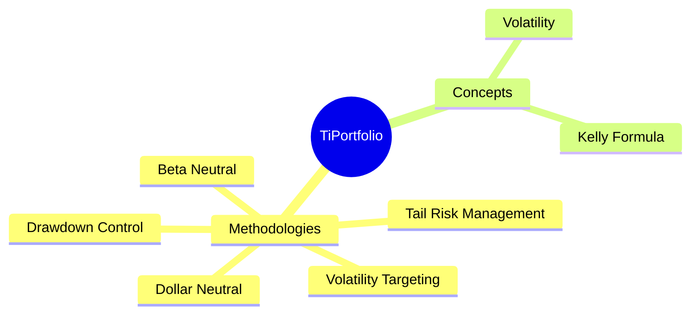
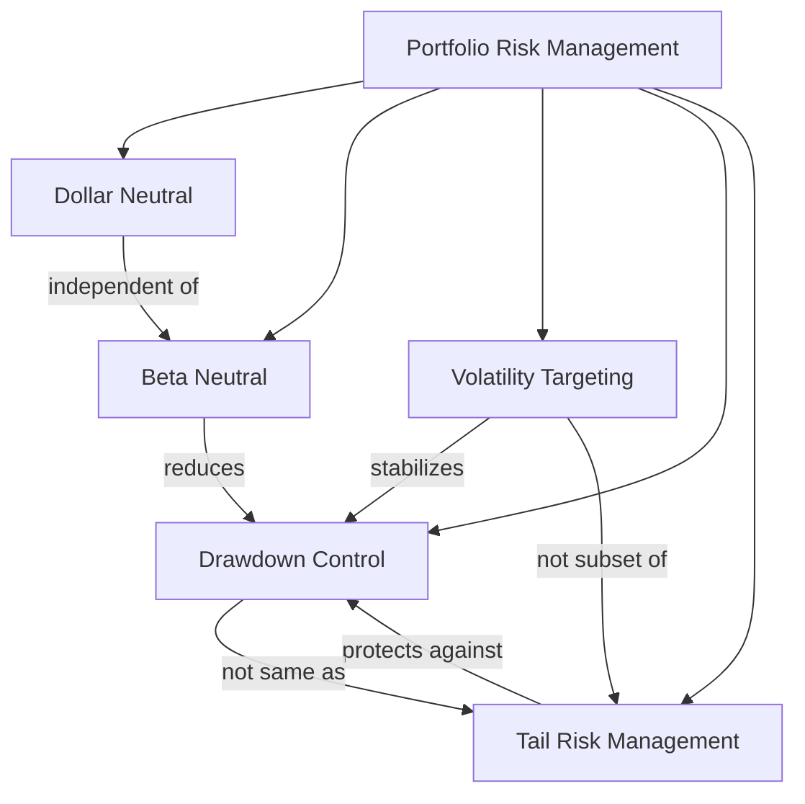

# TiPortfolio
A portfolio management tool with built-in state-of-the-art portfolio optimization algorithms, with extensibility for different use cases for both institutes and retail traders.

This project is built and tested with Python 3.12, however, it should be compatible with Python 3.10 and above.

## Why we need TiPortfolio?

> “More than 90% of the variability of a portfolio’s returns comes from asset allocation.”
> 
> — Brinson, Hood & Beebower, “Determinants of Portfolio Performance”

Since 2024, we have researched and investigated existing algorithmic trading, backtesting, and portfolio management libraries. After using many of them, we still have not found a strong option that truly focuses on portfolio management. The older Pyfolio library could have been a candidate, but it is no longer maintained.

While institutions and professional traders may rely on proprietary portfolio management systems, there is still no solid open-source solution for retail traders. Although implementing state-of-the-art portfolio optimization algorithms is not difficult from an engineering perspective, this area remains underserved.

We believe there is a significant gap here.

This is why we are building TiPortfolio: a portfolio management library dedicated to asset allocation, portfolio optimization, and risk management.

## Features
> including features work in progress

- [ ] Dollar neutral
- [ ] Beta neutral
- [ ] Tail risk management
- [ ] Volatility Targeting
- [ ] Drawdown control
- [ ] Simple Backtesting

