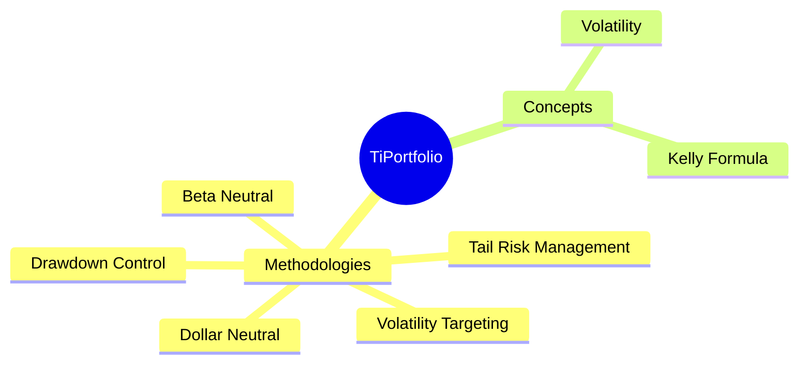
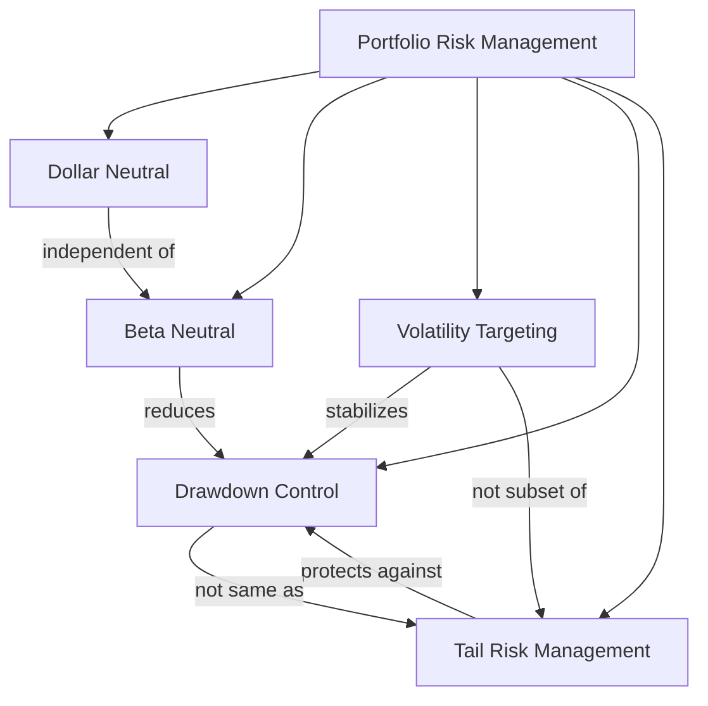

# TiPortfolio
A portfolio management tool with built-in state-of-the-art portfolio optimization algorithms, with extensibility for different use cases for both institutes and retail traders.

This project is built and tested with Python 3.12, however, it should be compatible with Python 3.10 and above.

## Features
> including features work in progress

- [ ] Dollar neutral
- [ ] Beta neutral
- [ ] Tail risk management
- [ ] Volatility Targeting
- [ ] Drawdown control
- [ ] Simple Backtesting

