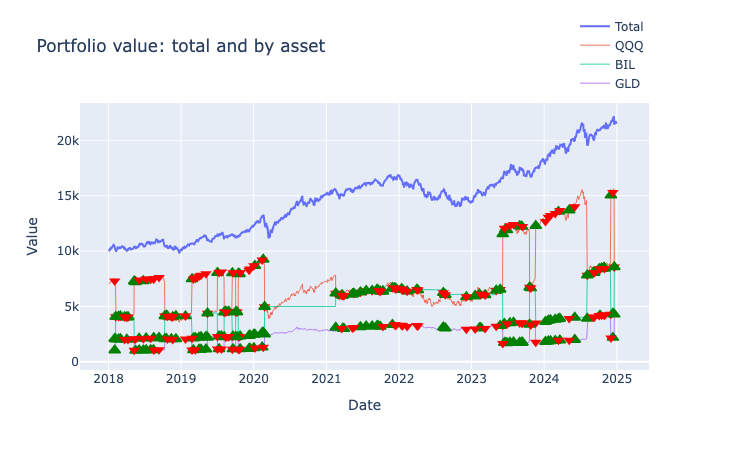

# TiPortfolio Documentation

A simple yet flexbile portfolio management tool with built-in state-of-the-art portfolio optimization algorithms, with extensibility for different use cases for both institutes and retail traders.

## Get started

> Let's started with a simple monthly rebalance assest allocation strategy, it will equal weight the portfolio among QQQ, BIL and GLD at the end of each month. This is commonly used strategy to keep the portfolio balanced and diversified, to reduce risk.

```python
import tiportfolio as ti

tickers = ["QQQ", "BIL", "GLD"]

# fetch data
data = ti.fetch_data(tickers, start="2019-01-01", end="2024-12-31") # this will return a dict of dataframe, key is ticker, value is dataframe with date as index and columns like open, close, high, low, volume

# built strategy to rebalance monthly with fix ratio allocation among QQQ, BIL and GLD
portfolio = ti.Portfolio(
    'monthly_rebalance',
    [
        # Order matters
        ti.Signal.Monthly(), # When
        ti.Select.All(),       # What
        ti.Weigh.Equally(),    # How much
        ti.Action.Rebalance() # Action
    ],
    tickers # match tickers
)

test = ti.Backtest(portfolio, data, fee_per_share=0.0035)
result = ti.run_backtest(test)
```

### Checking the Backtest Result


#### Interactive Chart

```python
# plot result
result.plot()
```




#### Key Metrics Summary
```python
# print key summary
result.summary()
```

```shell
Backtest Summary
----------------
Sharpe Ratio:        0.7071
Sortino Ratio:       0.8754
MAR Ratio:           0.6525
CAGR:                13.65%
Max Drawdown:        20.92%
Kelly Leverage:      5.1116
Mean Excess Return:  0.0978
Final Value:         24,465.96
Total Fee:           3.03
Rebalances:          44
```

#### Trade Records
```python
# print trade records
result.trades
```

| NO | date | equity_before | equity_after | fee_paid | QQQ_price | QQQ_qty_before | QQQ_trade_qty | QQQ_qty_after | QQQ_value_after | BIL_price | BIL_qty_before | BIL_trade_qty | BIL_qty_after | BIL_value_after | GLD_price | GLD_qty_before | GLD_trade_qty | GLD_qty_after | GLD_value_after |
| ---- | --------------------------- | --------------- | -------------- | ---------- | ----------- | ---------------- | --------------- | --------------- | ----------------- | ----------- | ---------------- | --------------- | --------------- | ----------------- | ----------- | ---------------- | --------------- | --------------- | ----------------- |
| 73 | 2024-03-01 05:00:00+00:00 | 23573.746     | 23573.736    | 0.010    | 440.77    | 37.968         | -0.530        | 37.438        | 16501.622       | 83.91     | 54.175         | 2.013         | 56.188        | 4714.749        | 192.89    | 11.887         | 0.334         | 12.221        | 2357.375        |
| 74 | 2024-04-01 04:00:00+00:00 | 23772.694     | 23772.689    | 0.005    | 440.70    | 37.438         | 0.322         | 37.760        | 16640.886       | 84.25     | 56.188         | 0.246         | 56.434        | 4754.539        | 207.82    | 12.221         | -0.782        | 11.439        | 2377.269        |
| 75 | 2024-05-01 04:00:00+00:00 | 22984.889     | 22984.877    | 0.012    | 417.49    | 37.760         | 0.778         | 38.538        | 16089.422       | 84.61     | 56.434         | -2.102        | 54.331        | 4596.978        | 213.79    | 11.439         | -0.688        | 10.751        | 2298.489        |
| 76 | 2024-06-03 04:00:00+00:00 | 24249.594     | 24249.581    | 0.013    | 448.80    | 38.538         | -0.716        | 37.822        | 16974.716       | 85.00     | 54.331         | 2.726         | 57.058        | 4849.919        | 217.22    | 10.751         | 0.412         | 11.164        | 2424.959        |
| 77 | 2024-07-01 04:00:00+00:00 | 25358.586     | 25358.573    | 0.013    | 478.08    | 37.822         | -0.693        | 37.130        | 17751.010       | 85.35     | 57.058         | 2.365         | 59.423        | 5071.717        | 215.57    | 11.164         | 0.600         | 11.764        | 2535.859        |


### Using TiPortfolio CLI:

> We can backtest a portfolio strategy through CLI without writing a single line of cod too:

```bash
pipx install tiportfolio
```


