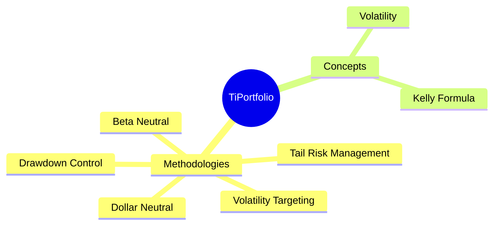
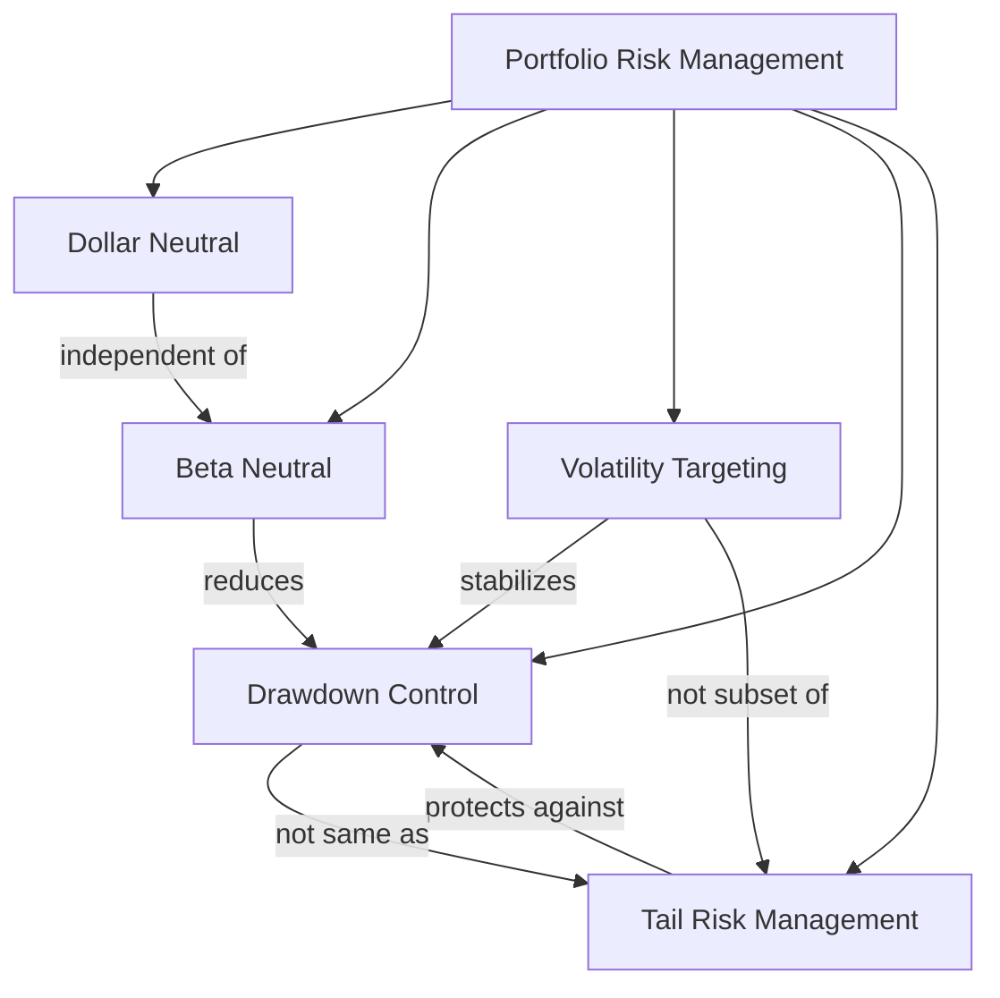

## Some Thoughts 
**What is a real alpha?**, I often ask myself this question,

- Is a positive return alpha?
- Is it a return above risk free rate?

A simple long hold strategy can easily achieve positive return and beat risk free rate in history.

**Sharpe Ratio, Mar Ratio, Annualized Return**, in these 3 metrics, the real alpha 
should have at least 1 out of 3 metrics better than the simple long hold Index ETF, 
and the other two not worse than the Index ETF. Otherwise, we really don't need to 
make a complex strategy to beat a simple long hold.

> The MAR ratio in finance measures risk-adjusted returns by dividing the compound annual growth rate (CAGR) of an investment by its largest drawdown. 

## Why we need TiPortfolio? What is the philosophy behind it?

You may have noticed that this library is probably different with any other backtesting libraries you can find in the market.

- It does not focus on high performance backtesting
- It does not force you to use specific way or library to write your strategies
- It does not even provide many built-in technical indicators or fundamental analysis indicators

Because we are trying to a bridge library between academic research and backtesting to seek real alpha.

This is not a real backtesting engine, because we didn't focus on backtesting speed, having more technology analysis or fundamental analysis  indicators, 
we give all these flexibility to end users, so yes, it is better to have more python experience.
Instead,
we are focusing on low frequent portfolio optimization and rebalancing to reduce cost and long term risk management, 
because no one can predict the market tomorrow, but everyone can know what is the cost and what are the volatility of his/her portfolio,
in another word, TiProtfolio is focusing on managing what you can manage, not what you cannot manage.

> “More than 90% of the variability of a portfolio’s returns comes from asset allocation.”
> 
> — Brinson, Hood & Beebower, “Determinants of Portfolio Performance”

Since 2024, we have researched and investigated existing algorithmic trading, backtesting, and portfolio management libraries. After using many of them, we still have not found a strong option that truly focuses on portfolio management. The older Pyfolio library could have been a candidate, but it is no longer maintained.

While institutions and professional traders may rely on proprietary portfolio management systems, there is still no solid open-source solution for retail traders. Although implementing state-of-the-art portfolio optimization algorithms is not difficult from an engineering perspective, this area remains underserved.

We believe there is a significant gap here.

This is why we are building TiPortfolio: a portfolio management library dedicated to asset allocation, portfolio optimization, and risk management.

