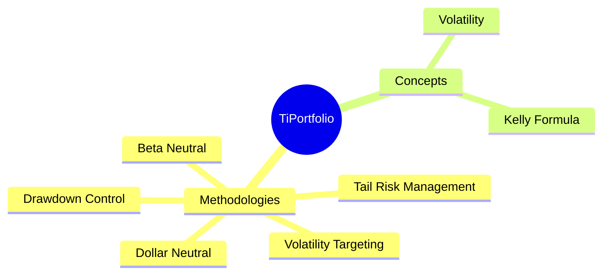
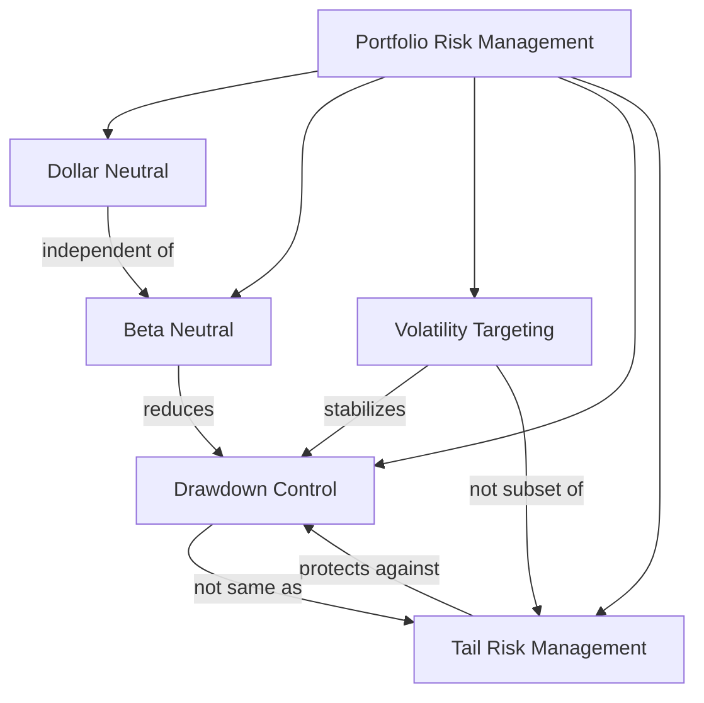

## Some Thoughts

From a question first: **what is real alpha?**.

- Is a positive return alpha?
- Is it a return above the risk-free rate?

A simple buy-and-hold strategy can achieve both in almost any historical window. That alone tells us neither metric is enough.

**Sharpe Ratio, MAR Ratio, Annualized Return** — real alpha means at least one of these three metrics beats a simple buy-and-hold index ETF, while the other two are no worse. If we cannot clear that bar, there is no reason to build a complex strategy. The index already won.

> The MAR ratio measures risk-adjusted returns by dividing the compound annual growth rate (CAGR) by the largest drawdown.

## Why We Are Building TiPortfolio

You may have noticed this library is different from other backtesting tools you can find in the market.

- It does not chase high-performance backtesting speed
- It does not force you into a specific framework for writing strategies
- It does not ship dozens of technical or fundamental indicators

These are deliberate choices. TiPortfolio is a bridge between academic portfolio research and practical backtesting — built to seek real alpha, not to simulate every possible trade.

This is not a backtesting engine in the traditional sense. We leave execution speed, indicator libraries, and signal generation to the tools that already do them well. Instead, we focus on what matters most for long-term returns:

**Low-frequency portfolio optimization, cost-aware rebalancing, and systematic risk management.**

No one can predict tomorrow's market. But everyone can know what their portfolio costs, what its volatility looks like, and whether their risk budget is intact. TiPortfolio is about managing what you can manage — not what you cannot.

> "More than 90% of the variability of a portfolio's returns comes from asset allocation."
>
> — Brinson, Hood & Beebower, *Determinants of Portfolio Performance*

Since 2024, we have researched and tested existing algorithmic trading, backtesting, and portfolio management libraries. After using many of them, we still have not found a strong open-source option that truly focuses on portfolio management. The older Pyfolio library could have been a candidate, but it is no longer maintained.

Institutions rely on proprietary systems. Retail traders have nothing comparable. Implementing state-of-the-art portfolio optimization is not difficult from an engineering perspective — but the gap between academic papers and usable tools remains wide.

This is why TiPortfolio exists: a portfolio management library dedicated to asset allocation, portfolio optimization, and risk management.

## Thoughts in charts

Concepts:

```mermaid
mindmap
root((TiPortfolio))
	Methodologies
		Dollar Neutral
		Beta Neutral
		Volatility Targeting
		Tail Risk Management
		Drawdown Control
	Concepts
		Volatility
		Kelly Formula
```

Strategy Ideas:

```mermaid
graph TD

    A[Portfolio Risk Management]

    A --> B[Dollar Neutral]
    A --> C[Beta Neutral]
    A --> D[Volatility Targeting]
    A --> E[Drawdown Control]
    A --> F[Tail Risk Management]

    C --reduces--> E
    D --stabilizes--> E
    F --protects against--> E

    D --not subset of--> F
    E --not same as--> F
    B --independent of--> C

```
